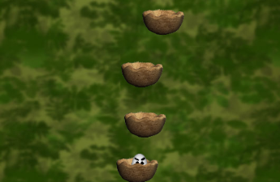

# EggJumpHTML5Game

A very old game made by me in 2012 (college times) only using the "new", in that time, HTML tag Canvas and pure JavaScript

This game is very simple: The just have to reach the highest level possible dropping an egg from a nest over one over it.

The first version of this game was made to work on "new" Windows 8 as an app, actually, as a "Windows Store App".

### Why this game is different from most JavaScript games today?

Because it was built only using HTML and JavaScript, no other JavaScript game library. Actually, this game is using one library, it is the [PxLoader](https://github.com/thinkpixellab/PxLoader) only to load resources.

Today there are very good options to build a game using HTML and JavaScript. For instance, my favorite one is [Phaser](https://github.com/photonstorm/phaser). But the HTML Canvas tag and JavaScript are enough to make an amazing game.
